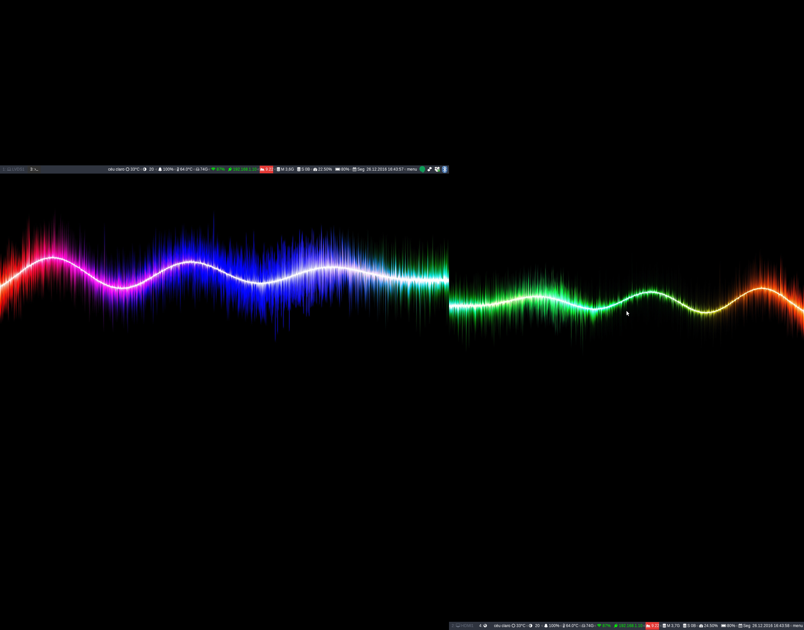

# i3wn-gapps
Dotfile i3wn-gapps

## Clone

`$ git clone --recursive git@github.com:robertov82008/i3wn.git ~/i3`

## Weather
`mv scripts/weather.sh.example scripts/weather.sh`


[openweathermap](http://openweathermap.org/city/)

```
id=''           # City
metric='metric'
unit=''         # temp: °F or °C
lang=''         # language
key=''          # Key - http://openweathermap.org/
```


## Install Fork i3wn-gapps (i3 with more features)

`$ sudo ./install-i3-gapps.sh`


## Install Programs and Config

`$ sudo ./install.sh`


**(apt-get)**

* vim
* feh
* arandr
* xbacklight
* rofi
* compton
* i3blocks
* pavucontrol
* lm-sensors
* nitrogen
* thunar
* thunar-dropbox-plugin
* zsh
* lxappearance
* aptitude

**(ppa)**

* fontconfig-infinality
* moka-icon-theme

**(github)**

* snapfly
* morc_menu
* Font-Awesome
* YosemiteSanFranciscoFont
* arc-theme
* arc-firefox-theme
* playerctl
* i3blocks-contrib


```
screenfetch 
                          ./+o+-       user@ubuntu
                  yyyyy- -yyyyyy+      OS: Ubuntu 16.04 xenial
               ://+//////-yyyyyyo      Kernel: x86_64 Linux 4.4.0-57-generic
           .++ .:/++++++/-.+sss/`      Uptime: 3h 40m
         .:++o:  /++++++++/:--:/-      Packages: 2976
        o:+o+:++.`..```.-/oo+++++/     Shell: zsh 5.1.1
       .:+o:+o/.          `+sssoo+/    Resolution: 2446x1920
  .++/+:+oo+o:`             /sssooo.   WM: i3
 /+++//+:`oo+o               /::--:.   GTK Theme: Arc-Dark [GTK2/3]
 \+/+o+++`o++o               ++////.   Icon Theme: Moka
  .++.o+++oo+:`             /dddhhh.   Font: System San Francisco Display 9
       .+.o+oo:.          `oddhhhh+    CPU: Intel Celeron CPU B820 @ 1.7GHz
        \+.++o+o``-````.:ohdhhhhh+     GPU: Mesa DRI Intel(R) Sandybridge Mobile 
         `:o+++ `ohhhhhhhhyo++os:      RAM: 4742MiB / 7684MiB
           .o:`.syhhhhhhh/.oo++o`     
               /osyyyyyyo++ooo+++/    
                   ````` +oo+++o\:    
                          `oo++.      
```

## Screenhot



# keybinds i3wm

**$mod(Win Key)**


## Layout 

keybinds | Change borders
------------ | -------------
**$mod+u** | border none
**$mod+y** | border pixel
**$mod+n** | border normal


keybinds| kill focused window
------------ | -------------
**$mod+Shift+q** | kill

keybinds | Close workspace and skip anothor open workspace
------------ | -------------
**$mod+Shift+Delete** | kill

keybinds | Change focus
------------ | -------------
**$mod+j** | left
**$mod+k** | down
**$mod+l** | up
**$mod+ccedilla** | right

keybinds | alternatively, you can use the cursor keys
------------ | -------------
**$mod+Left** | left
**$mod+Down** | down
**$mod+Up** | up 
**$mod+Right** | right


keybinds | move focused window 
------------ | -------------
**$mod+Shift+j** | left
**$mod+Shift+k** | down
**$mod+Shift+l** | up 
**$mod+Shift+ccedilla** | right


keybinds | alternatively, you can use the cursor keys
------------ | -------------
**$mod+Shift+Left** | left
**$mod+Shift+Down** | down
**$mod+Shift+Up** | up 
**$mod+Shift+Right** | right
 
keybinds | split in horizontal orientation 
------------ | -------------
**$mod+h** | split

keybinds | split in vertical orientation 
------------ | -------------
**$mod+h** | split


keybinds | enter fullscreen mode for the focused container 
------------ | -------------
**$mod+f** | fullscreen


keybinds | change container layout (stacked, tabbed, toggle split) 
------------ | -------------
**$mod+s** | stacking
**$mod+w** | tabbed
**$mod+e** | toggle split


keybinds | toggle tiling / floating 
------------ | -------------
**$mod+Shift+space** | tiling/floating


keybinds | change focus between tiling / floating windows
------------ | -------------
**$mod+space** | focus tiling/floating


keybinds | focus the parent container 
------------ | -------------
**$mod+a** | parent


keybinds | focus the child container
------------ | -------------
**$mod+z** | child


keybinds | resize window (you can also use the mouse for that) 
------------ | -------------
**$mod+r** | resize 


## Workspace 

keybinds | switch to workspace 
------------ | -------------
**$mod+1** | workspace1 
**$mod+2** | workspace2
**$mod+3** | workspace3
**$mod+4** | workspace4
**$mod+5** | workspace5
**$mod+6** | workspace6
**$mod+7** | workspace7
**$mod+8** | workspace8
**$mod+9** | workspace9
**$mod+10** | workspace10

keybinds | move focused container to workspace 
------------ | -------------
**$mod+Shift+1** | workspace1 
**$mod+Shift+2** | workspace2
**$mod+Shift+3** | workspace3
**$mod+Shift+4** | workspace4
**$mod+Shift+5** | workspace5
**$mod+Shift+6** | workspace6
**$mod+Shift+7** | workspace7
**$mod+Shift+8** | workspace8
**$mod+Shift+9** | workspace9
**$mod+Shift+10** | workspace10

keybinds | reload the configuration file 
------------ | -------------
**$mod+Shift+c** | reload


keybinds | restart i3 inplace (preserves your layout/session, can be used to upgrade i3) 
------------ | -------------
**$mod+Shift+r** | restart


## Menu 


keybinds | Rofi 
------------ | -------------
**$mod+Shift+d** | run
**$mod+Ctrl+d** | window
**$mod+Alt+d** | ssh


keybinds | Snapfly 
------------ | -------------
**$mod+d** | show

keybinds | Automatic switching to the current workspace 
------------ | -------------
**$mod+Tab** | switch workspaces
**alt+tab** | switch right
**alt+shift+tab** | switch left


# focus next, previous panel
bindsym Mod1+Tab focus 
bindsym Mod1+Shift+Tab focus 

## Shortcut 

keybinds | Volume controls  
------------ | -------------
**XF86AudioRaiseVolume** | +increase
**XF86AudioLowerVolume** | - decrease
**XF86AudioMute** | mute

keybinds | Sreen brightness controls 
------------ | -------------
**XF86MonBrightnessUp** | +increase
**XF86MonBrightnessDown** | - decrease

keybinds | Touchpad controls (Enable and Disable) 
------------ | -------------
**XF86TouchpadToggle** | touchpad


keybinds | Media player controls 
------------ | -------------
**XF86AudioPlay** | play
**XF86AudioPause** | pause
**XF86AudioNext** | next
**XF86AudioPrev** | previous

keybinds | start a terminal 
------------ | -------------
**$mod+Return** | i3-sensible-terminal

keybinds | Screen Shots 
------------ | -------------
**$mod+Return** | mate-screenshot area
**$mod+Return** | mate-screenshot all
**$mod+Return** | mate-screenshot window


keybinds | File Explorer 
------------ | -------------
**$mod+Shift+f** | caja


keybinds | Calender 
------------ | -------------
**$mod+c** | zenity


keybinds | gap mode 
------------ | -------------
**$mod+Shift+g** | modifying
**o** | outer
**i** | inner
**+** | outer/inner local increment
**-** | outer/inner local decrement
**Shift+(+)** | outer/inner local increment
**Shift+(-)** | outer/inner local decrement

>Press $mod+Shift+g to enter the . Choose or i for  outer/inner gaps. 
>Press one of + / - (in-/decrement for current workspace) or 0 (remove gaps for current workspace).
>If you also press Shift with these keys, the change will be global for all workspaces. 


## System 

keybinds | exit i3 (logs you out of your X session) 
------------ | -------------
**$mod+delete** | menu

keybinds | exit i3 (logs you out of your X session) 
------------ | -------------
**$mod+Shift+x** | i3lock