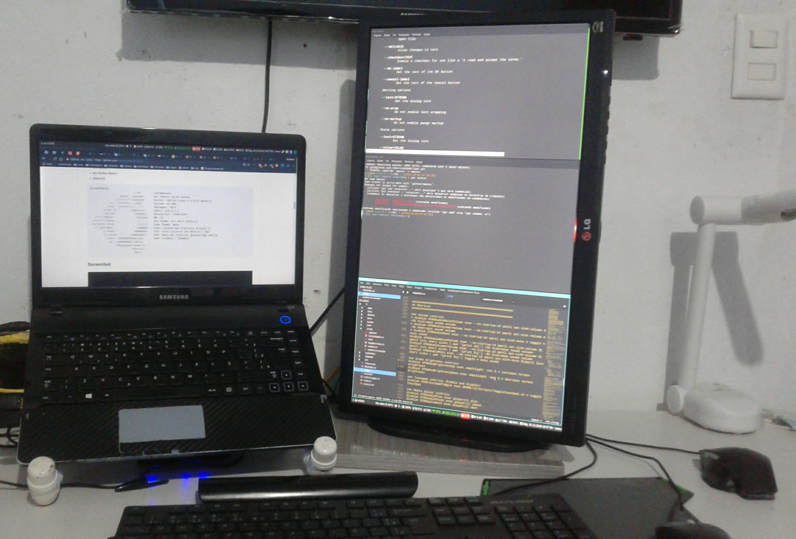

# i3wn-gapps
Dotfile i3wn-gapps

## Clone

`$ git clone git@github.com:robertov82008/i3wn.git ~/i3`

## Weather
`mv scripts/weather.sh.example scripts/weather.sh`


[openweathermap](http://openweathermap.org/city/)

```
id=''           # City
metric='metric'
unit=''         # temp: °F or °C
lang=''         # language
key=''          # Key - http://openweathermap.org/
```


## Install Fork i3wn-gapps (i3 with more features)

`$ sudo ./install-i3-gapps.sh`


## Install Programs and Config

`$ sudo ./install.sh`


**(apt-get)**

* vim
* feh
* arandr
* xbacklight
* rofi
* compton
* i3blocks
* pavucontrol
* lm-sensors
* nitrogen
* thunar
* thunar-dropbox-plugin
* zsh
* lxappearance

**(ppa)**

* fontconfig-infinality
* moka-icon-theme

**(github)**

* snapfly
* morc_menu
* Font-Awesome
* YosemiteSanFranciscoFont
* arc-theme
* arc-firefox-theme
* playerctl


```
screenfetch 
                          ./+o+-       user@ubuntu
                  yyyyy- -yyyyyy+      OS: Ubuntu 16.04 xenial
               ://+//////-yyyyyyo      Kernel: x86_64 Linux 4.4.0-57-generic
           .++ .:/++++++/-.+sss/`      Uptime: 3h 40m
         .:++o:  /++++++++/:--:/-      Packages: 2976
        o:+o+:++.`..```.-/oo+++++/     Shell: zsh 5.1.1
       .:+o:+o/.          `+sssoo+/    Resolution: 2446x1920
  .++/+:+oo+o:`             /sssooo.   WM: i3
 /+++//+:`oo+o               /::--:.   GTK Theme: Arc-Dark [GTK2/3]
 \+/+o+++`o++o               ++////.   Icon Theme: Moka
  .++.o+++oo+:`             /dddhhh.   Font: System San Francisco Display 9
       .+.o+oo:.          `oddhhhh+    CPU: Intel Celeron CPU B820 @ 1.7GHz
        \+.++o+o``-````.:ohdhhhhh+     GPU: Mesa DRI Intel(R) Sandybridge Mobile 
         `:o+++ `ohhhhhhhhyo++os:      RAM: 4742MiB / 7684MiB
           .o:`.syhhhhhhh/.oo++o`     
               /osyyyyyyo++ooo+++/    
                   ````` +oo+++o\:    
                          `oo++.      
```

## Screenhot



**$mod(Win Key)**


## Layout 
=========================================================


### Change borders 

`bindsym` **$mod+u** `border none`

`bindsym` **$mod+y** `border pixel 1 `

`bindsym` **$mod+n** `border normal`

### kill focused window 

`bindsym` **$mod+Shift+q** `kill` 

### Close workspace and skip anothor open workspace` 

`bindsym` **$mod+Shift+Delete** `kill, workspace prev` 

### change focus 

`bindsym` **$mod+j** `focus left` 

`bindsym` **$mod+k** `focus down` 

`bindsym` **$mod+l** `focus up` 

`bindsym` **$mod+ccedilla** `focus right` 

### alternatively, you can use the cursor keys: 

`bindsym` **$mod+Left** `focus left` 

`bindsym` **$mod+Down** `focus down` 

`bindsym` **$mod+Up** `focus up` 

`bindsym` **$mod+Right** `focus right` 

### move focused window 

`bindsym` **$mod+Shift+j** `move left` 

`bindsym` **$mod+Shift+k** `move down` 

`bindsym` **$mod+Shift+l** `move up` 

`bindsym` **$mod+Shift+ccedilla** `move right` 

### alternatively, you can use the cursor keys: 

`bindsym` **$mod+Shift+Left** `move left` 

`bindsym` **$mod+Shift+Down** `move down` 

`bindsym` **$mod+Shift+Up** `move up` 

`bindsym` **$mod+Shift+Right** `move right` 

### split in horizontal orientation 

`bindsym` **$mod+h** `split h` 

### split in vertical orientation 

`bindsym` **$mod+v** `split v` 

### enter fullscreen mode for the focused container 

`bindsym` **$mod+f** `fullscreen toggle`

### change container layout (stacked, tabbed, toggle split) 

`bindsym` **$mod+s** `layout stacking` 

`bindsym` **$mod+w** `layout tabbed` 

`bindsym` **$mod+e** `layout toggle split` 

### toggle tiling / floating 

`bindsym` **$mod+Shift+space** `floating toggle` 

### change focus between tiling / floating windows` 

`bindsym` **$mod+space** `focus mode_toggle 

### focus the parent container 

`bindsym` **$mod+a** `focus parent` 

### resize window (you can also use the mouse for that) 

`bindsym` **$mod+r** `mode "  "` 

=========================================================
## Workspace 
=========================================================

### switch to workspace 

`bindsym` **$mod+1** `workspace $workspace1` 

`bindsym` **$mod+2** `workspace $workspace2` 

`bindsym` **$mod+3** `workspace $workspace3` 

`bindsym` **$mod+4** `workspace $workspace4` 

`bindsym` **$mod+5** `workspace $workspace5` 

`bindsym` **$mod+6** `workspace $workspace6` 

`bindsym` **$mod+7** `workspace $workspace7` 

`bindsym` **$mod+8** `workspace $workspace8` 

`bindsym` **$mod+9** `workspace $workspace9` 

`bindsym` **$mod+0** `workspace $workspace10` 

### move focused container to workspace 

`bindsym` **$mod+Shift+1** `move container to workspace $workspace1` 

`bindsym` **$mod+Shift+2** `move container to workspace $workspace2` 

`bindsym` **$mod+Shift+3** `move container to workspace $workspace3` 

`bindsym` **$mod+Shift+4** `move container to workspace $workspace4` 

`bindsym` **$mod+Shift+5** `move container to workspace $workspace5` 

`bindsym` **$mod+Shift+6** `move container to workspace $workspace6` 

`bindsym` **$mod+Shift+7** `move container to workspace $workspace7` 

`bindsym` **$mod+Shift+8** `move container to workspace $workspace8` 

`bindsym` **$mod+Shift+9** `move container to workspace $workspace9` 

`bindsym` **$mod+Shift+0** `move container to workspace $workspace10` 

### reload the configuration file 

`bindsym` **$mod+Shift+c** `reload` 

### restart i3 inplace (preserves your layout/session, can be used to upgrade i3) 

`bindsym` **$mod+Shift+r** `restart` 


=========================================================
## Menu 
=========================================================


### Rofi 

`bindsym` **$mod+Shift+d exec** `rofi -show run -opacity "85" -font "System San Francisco Display 14"` 

`bindsym` **$mod+Ctrl+d** `exec rofi -show window -opacity "85" -font "System San Francisco Display 14"` 

`bindsym` **$mod+Mod1+d** `exec rofi -show ssh -opacity "85" -font "System San Francisco Display 14"` 

### Snapfly 

`bindsym` **$mod+d exec** `snapfly-show` 


=========================================================
## Shortcut 
=========================================================


### Volume controls 

`bindsym` **XF86AudioRaiseVolume** `exec --no-startup-id pactl set-sink-volume $(pactl list short sinks | awk '{print $1}') +5% #increase sound volume` 

`bindsym` **XF86AudioLowerVolume** `exec --no-startup-id pactl set-sink-volume $(pactl list short sinks | awk '{print $1}') -5% #increase sound volume` 

`bindsym` **XF86AudioMute** `exec --no-startup-id pactl set-sink-mute $(pactl list short sinks | awk '{print $1}') toggle # mute sound` 

### Sreen brightness controls 

`bindsym` **XF86MonBrightnessUp** `exec xbacklight -inc 20 # increase screen brightness` 

`bindsym` **XF86MonBrightnessDown** `exec xbacklight -dec 20 # decrease screen brightness` 

### Touchpad controls (Enable and Disable) 

`bindsym` **XF86TouchpadToggle** `exec $HOME/i3/scripts/toggletouchpad.sh # toggle touchpad` 

### Media player controls 

`bindsym` **XF86AudioPlay** `exec playerctl play` 

`bindsym` **XF86AudioPause** `exec playerctl pause` 

`bindsym` **XF86AudioNext** `exec playerctl next` 

`bindsym` **XF86AudioPrev** `exec playerctl previous` 

### start a terminal 

`bindsym` **$mod+Return** `exec i3-sensible-terminal` 

### Screen Shots 

`bindsym` **$mod+p** `exec mate-screenshot --area` 

`bindsym` **$mod+Shift+p** `exec mate-screenshot` 

`bindsym` **$mod+Ctrl+p** `exec mate-screenshot -w`

### File Explorer 

`bindsym` **$mod+Shift+f** `exec caja` 

### Show Calender 

`bindsym` **$mod+c** `exec zenity --calendar` 

### Press $mod+Shift+g to enter the gap mode. Choose o or i for modifying outer/inner gaps. Press one of + / - (in-/decrement for current workspace) or 0 (remove gaps for current workspace). If you also press Shift with these keys, the change will be global for all workspaces. 

`bindsym` **$mod+Shift+g** `mode "$mode_gaps"` 


=========================================================
## System 
=========================================================


### exit i3 (logs you out of your X session) 

`bindsym` **$mod+Shift+e** `mode "$mode_system"` 

### lock screen 

`bindsym` **$mod+Shift+x** `exec i3lock -e -i $HOME/i3/wallpaper/electriccolor/electriccolor.png -c 000000` 


